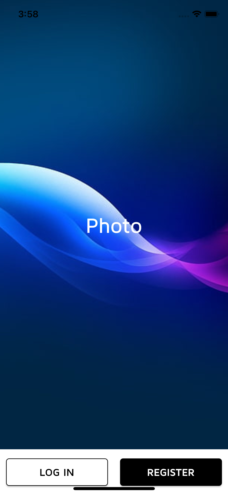
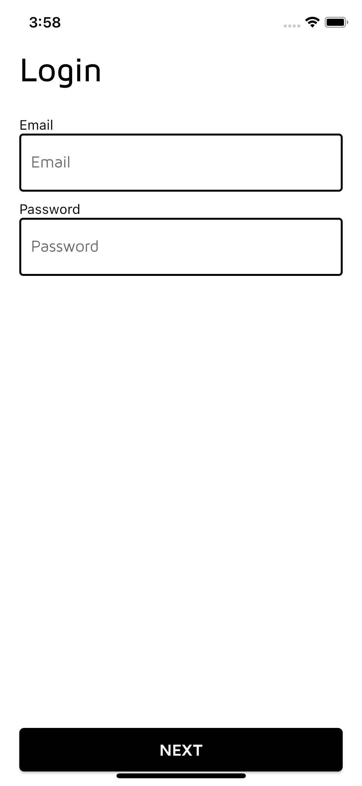

# mobile_wallet

Mobile Wallet

## Build For iOS

- Get Packages
- Pod Install
- Fix Generated.xcconfig path in Xcode

#### Clean Build

flutter clean

##### JSON Annotation

- One-time code generation
  Use: `flutter pub run build_runner build --delete-conflicting-outputs`
- Generating code continuously
  Use: `flutter pub run build_runner watch`

#### Screenshots

